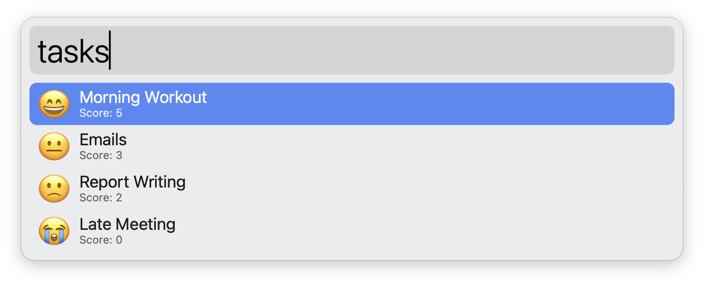

# `alfred-emoji-json`

A command-line tool that takes [Alfred Script Filter JSON](https://www.alfredapp.com/help/workflows/inputs/script-filter/json/) as input, replaces any `"icon"` objects with `"{type": "emoji", "path": "<EMOJI>"}` (where `<EMOJI>` is the desired emoji) by generating a PNG file for the emoji, and outputs the modified JSON where the `"icon"` points to the generated PNG.

Use it by [piping](https://www.gnu.org/software/bash/manual/html_node/Pipelines.html) JSON into the `alfred-emoji-json`.

## Details

- Emoji should be placed in the `"path"` field of the `"icon"` object with `"type": "emoji"`
  - (e.g. `"icon": { "type": "emoji", "path": "😃" }`)
- Emojis are converted into 256px transparent PNG files stored in `./emojis/`.
- The `./emojis` directory is created automatically in workflow folder if it does not exist.
- PNG files are reused if already generated, speeding up repeated runs.

## Raw JSON example 

Here is an example of the raw JSON that you might generate from your program:

```json
{
  "items": [
    {
      "title": "Build Project",
      "subtitle": "Build succeeded",
      "arg": "build",
      "icon": {
        "type": "emoji",
        "path": "🟢"
      }
    },
    {
      "title": "Run Tests",
      "subtitle": "Tests failed",
      "arg": "test",
      "icon": {
        "type": "emoji",
        "path": "🔴"
      }
    }
  ]
}
```

Pipe the JSON through the `alfred-emoji-json`:

```bash
cat tasks.json | ./alfred-emoji-json
```


## Code example

Consider the following Python code, which generates Alfred Script Filter JSON with emoji icons based on task scores:

```python
#!/usr/bin/env python3
import json

# Simple list of (task, score) tuples
tasks = [
    ("Morning Workout", 5),
    ("Emails", 3),
    ("Report Writing", 2),
    ("Late Meeting", 0)
]

# Map scores to emojis
emojis = ["😭", "😢", "🙁", "😐", "🙂", "😄"]

items = []
for task, score in tasks:
    item = {
        "title": task,
        "subtitle": f"Score: {score}",
        "arg": task,
        "icon": {"type": "emoji", "path": emojis[score]}
    }
    items.append(item)

output = {"items": items}
print(json.dumps(output, ensure_ascii=False, indent=2))
```

Pipe the output into the `alfred-emoji-json` to automatically convert the emojis into PNG icons:

```bash
./example.py | ./alfred-emoji-json
```



## Installation

There are two ways to install `alfred-emoji-json`:

### 1. Build from source

```bash
git clone https://github.com/svenko99/alfred-emoji-json.git
cd alfred-emoji-json
swiftc src/alfred-emoji-json.swift -o alfred-emoji-json
chmod +x alfred-emoji-json
```
This creates the `alfred-emoji-json` executable in the current folder. Move the file into your Alfred workflow folder to use it.

### 2. Download binary

[⤓ Download](https://github.com/svenko99/alfred-emoji-json/releases/latest/download/alfred-emoji-json) the prebuilt unsigned binary.
After downloading, make it executable by running: `chmod +x alfred-emoji-json`. Then move the file into your Alfred workflow folder to use it.

If macOS blocks execution due to security settings, run: `sudo xattr -rd com.apple.quarantine ./alfred-emoji-json`.

